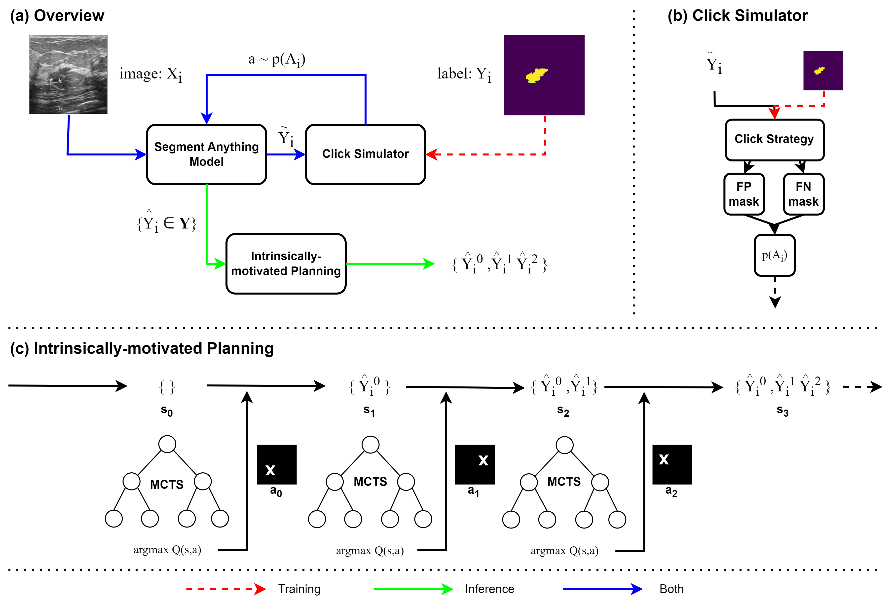

# Multiple Hypothesis Prediction via Simulated Interaction and Intrinsically-motivated Planning for Medical Image Segmentation

Official code for the 2024 CVPR submission: *Multiple Hypothesis Prediction via Simulated Interaction and Intrinsically-motivated Planning for Medical Image Segmentation*.

## Repo Overview
The repo is structured as follows. `scripts/` contains all of the files that can be run. The core functionality is contained in the `src/` folder. `src/modeling.py` contains the various models. `src/click.py` contains the different click strategies for SLIP. `src/search.py` contains the MCTS intrinsically-motivated planning. `src/metrics.py` contains the evaluation metrics. `src/corpora.py` contains the datasets. 

## Requirements
* datasets
* monai
* numpy
* opencv-python
* torch
* transformers

To install relevant dependencies run:
```shell
pip install -r requirements.txt
```

This repo also uses [surface-distance](https://github.com/google-deepmind/surface-distance/tree/master), which should be included in the root folder.

## Downloading the datasets
This paper makes use of three datasets, which need to be separately downloaded.
- Breast Ultrasound Scans can be downloaded from [Kaggle](https://www.kaggle.com/datasets/aryashah2k/breast-ultrasound-images-dataset).
- CVC ClinicDB is available [here](https://polyp.grand-challenge.org/CVCClinicDB/).
- ISIC 2016 is available [here](https://challenge.isic-archive.com/data/#2016) (you should download Task 1).
Downloaded content should be placed in the `data/` folder.

## Training

All of the baselines and our method can be trained via the `scripts/train.py` file. The available model types are `["baseline", "simsr", "theta"]`. The available datasets are `["busi", "cvc", "isic"]`.

```shell
python scripts/train.py --model_save_path PATH/TO/SAVE/MODEL \ 
    --model_type baseline \
    --num_train_epochs 10 \
    --learning_rate 1e-5 \
    --dataset busi
```

To train the theta model, use should first train the main SLIP model for a given dataset, then provide the SLIP model via the `teacher_load_path` parameter, i.e.

```shell
python scripts/train.py --model_save_path PATH/TO/SAVE/MODEL \ 
    --teacher_load_path PATH/TO/SLIP/MODEL \
    --model_type theta \
    --num_train_epochs 10 \
    --learning_rate 1e-5 \
    --dataset busi
```

## Evaluation
To evaluate the model use the `scripts/eval_single.py` file. The `click_strategy` argument can take one of `["threshold", "sampling", "theta"]`. Specific hyperparameters for each can be defined as `tau`, `theta_tau`, and `threshold`.

```shell
python scripts/eval_single.py --model_load_path PATH/TO/LOAD/MODEL \
    --dataset busi \
    --model_type simsr
    --click_strategy sampling \
```
